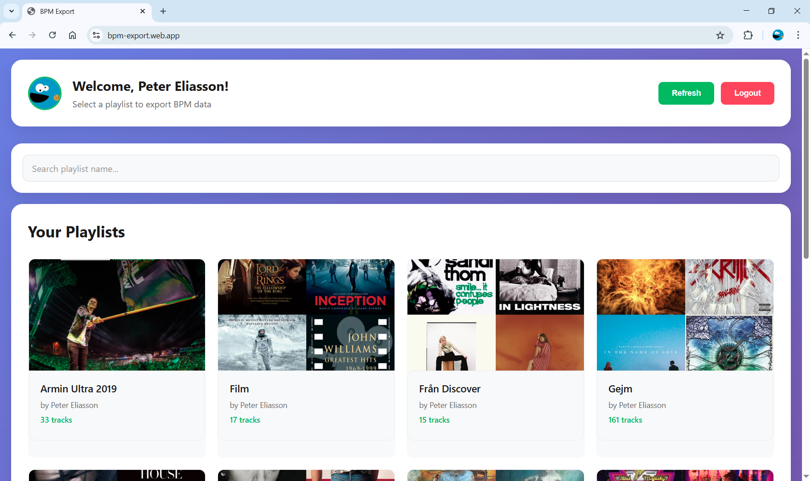

# BPM Export

Exports BPM information from Spotify playlists.

A client-side only React app developed using Cursor, to try some AI programming. Very amazing.

**Note**: The export features doesn't actually work, since Spotify has deprecated its audio-features API... :upside_down_face:

**Note2**: Spotify does not allow non-organizations to apply for moving App Status from "Development mode". In "Development mode" only explicitly allowed users can access the app.

## Screenshots

### Login Screen


### Playlist Selection


### Export View


## Setup

### Spotify API Configuration

To use this application, you need to configure Spotify API credentials:

1. Go to [Spotify Developer Dashboard](https://developer.spotify.com/dashboard)
2. Create a new application
3. Add your redirect URI (e.g., `http://127.0.0.1:5173` for development)
4. Add allowed users to "User Management" tab (required while app is in "development mode")
5. Copy your Client ID

Create a `.env` file in the root directory with:

```env
VITE_SPOTIFY_CLIENT_ID=your_spotify_client_id_here
```

### Development

```bash
npm install
npm run dev
```

### Build

```bash
npm run build
```

### Deploy to Firebase

```bash
npm run build
firebase deploy
```
